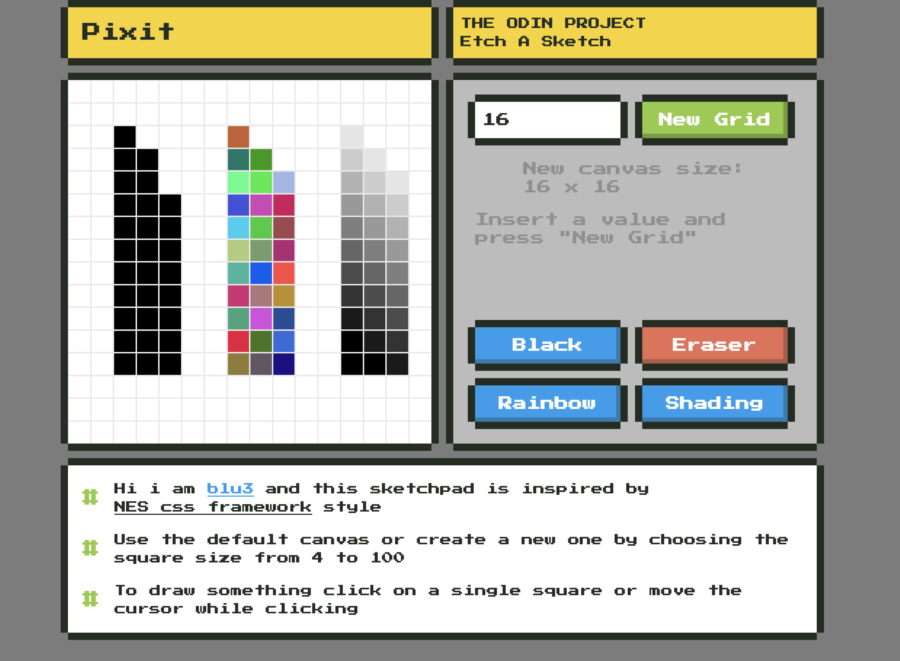

# Etch a Sketch #

Sketchpad project for the Odin Project Foundations Course
[Live demo](https://blu3tan.github.io/Etch-A-Sketch/)

# Concept #

This is my version of the Etch a Sketch exercise, it is inspired graphically
by the ui style of the Classic NES.

Overall it was very fun building it, took a lot of effort and now that is done
i can say i have a much deeper understanding of the DOM manipulation,
in particular events listeners.

I'm approaching every project as if it was a real website or web-app meant to be
used by someone (even tho actually it is already).
I always try to set up an interesting (at least imo) ui, a smooth ux and
at least mobile responsiveness.

# Code logic #

Just a note about the shading function.
Now that i am done i've seen that others have interpreted the assignment in other
ways. In my mind it was a mode meant to create a sort of faded pencil effect,
10 degrees from white to black one square to the next.
Anyway it works and i kinda like it.

# Credits #

The graphical inspiration is from https://nostalgic-css.github.io/NES.css/
an awesome css NES framework, i haven't used it tho, just took inspiration
for colors, buttons styling and general layout.

A great thanks as always goes to the entire Odin Project community discord,
whenever i'm stuck on a path there's always someone there to put me back on
track.
Much love.